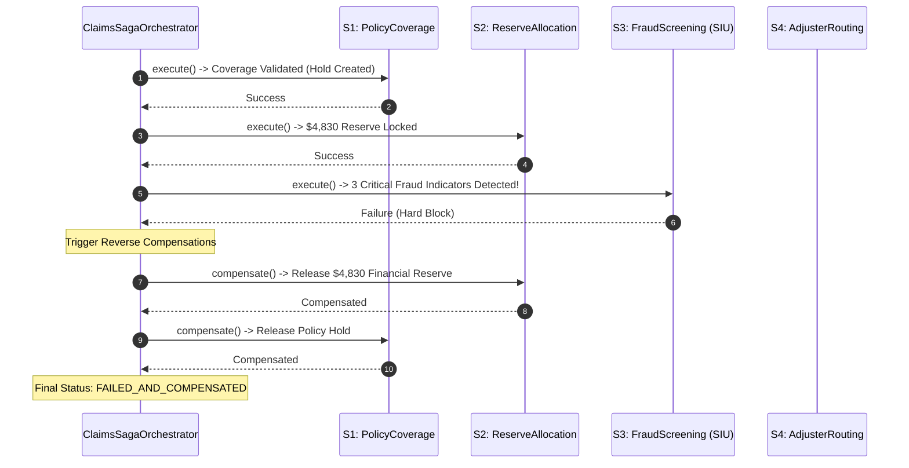

# ClaimSight — Insurance Claims Triage & Saga Orchestration Engine

<div align="center">

[](https://www.python.org/)
[](https://fastapi.tiangolo.com/)
[](https://streamlit.io/)
[](https://mlflow.org/)
[](https://www.docker.com/)
[](https://github.com/astral-sh/ruff)
[](https://pytest.org/)

</div>

> **Automated insurance claims triage, LightGBM loss severity prediction, and Special Investigation Unit (SIU) fraud auditing powered by a distributed Saga Orchestration Architecture with automatic compensating rollbacks — guaranteeing transactional consistency across disparate core policy, financial reserve, and adjuster dispatch subsystems.**

---

## 🏛️ Architecture Pattern

**Saga Orchestration with Compensating Transactions**

Property & Casualty (P&C) claims intake crosses multiple independent enterprise boundaries:
- **Core Policy Admin:** Verifying active coverage and establishing policy claim holds.
- **Financial Treasury:** Locking statutory loss reserve capital from corporate liquidity pools.
- **Fraud / SIU Audit:** Multi-factor heuristic screening for staged accidents or inflated claims.
- **Workforce Management:** Assigning specialized licensed claims adjusters.
- **Payment Clearing:** Authorizing initial payment disbursement tokens.

If a fraud hard-block triggers at Step 3, or if financial limits are breached at Step 2, conventional distributed systems leave orphaned reserve holds and locked adjuster queues.

The **Saga Orchestrator Pattern** executes forward steps sequentially. Upon any validation error, policy failure, or fraud exception, the orchestrator halts forward execution and executes the **compensating rollback sequence** in reverse chronological order ($S_{k-1}^{-1}, S_{k-2}^{-1}, \dots, S_1^{-1}$), restoring absolute cross-system consistency:



### Saga Step & Compensation Matrix

| Step | Forward Action | Compensating Rollback Action ($S^{-1}$) |
|---|---|---|
| `ValidatePolicyCoverageStep` | Checks active policy tenure; establishes policy claim hold | Releases policy claim hold; marks policy inactive for claim |
| `FinancialReserveAllocationStep` | Calculates 115% reserve buffer; locks financial hold | Releases locked reserve balance back to treasury |
| `FraudRiskScreeningStep` | Evaluates rule heuristics (late report, round sums) | Clears temporary SIU escalation flags |
| `AdjusterRoutingStep` | Assigns claim to senior liability or auto adjuster | De-allocates adjuster queue slot |
| `SettlementAuthorizationStep` | Mints settlement authorization token | Voids settlement token |

---

## 📐 Mathematical Formulation

### 1. LightGBM Loss Severity Model

Claim settlement costs follow a heavy-tailed log-normal distribution. The severity model predicts log-dollar loss:

$$\hat{y}_i = \text{LGBM}\left(X_i^{\text{features}}\right), \quad \hat{S}_i = \exp\left(\hat{y}_i\right)$$

To guard against under-reserving, the recommended statutory financial reserve incorporates the 75th percentile residual safety margin:

$$\text{Reserve}_i = \hat{S}_i \times \exp\left(z_{0.75} \cdot \sigma_{\text{residual}}\right)$$

### 2. Multi-Factor Fraud Heuristic Screening

Claims are audited against explainable, non-black-box fraud triggers:
- **Late Reporting:** $\text{ReportDelayDays} \ge 30 \implies \text{flag}_{\text{late}}$
- **Round Dollar Anomaly:** $\text{ClaimedAmount} \equiv 0 \pmod{1000} \land \text{ClaimedAmount} \ge 5000 \implies \text{flag}_{\text{round}}$
- **Inception Proximity:** $\text{PolicyTenureDays} \le 14 \implies \text{flag}_{\text{inception}}$
- **Unwitnessed Single Vehicle:** $\text{VehicleAge} > 10 \land \text{PoliceReport} = 0 \implies \text{flag}_{\text{no\_police}}$

$$\text{Fraud Risk Score} = \sum_{j=1}^m w_j \cdot \mathbb{I}(\text{flag}_j), \quad \text{Hard SIU Block if } \sum \mathbb{I}(\text{flag}_j) > 2$$

---

## 🚀 Quick Start & Usage

```bash
# Setup environment and run tests
uv sync
uv run pytest

# Launch FastAPI microservice & Streamlit claims workbench
uv run uvicorn claimsight.api.routes:app --reload --port 8000
```

### Programmatic Saga Execution

```python
from claimsight.saga import ClaimsSagaOrchestrator, SagaStatus

orchestrator = ClaimsSagaOrchestrator()

# 1. Normal Claim Execution (Runs all 5 stages successfully)
claim_payload = {
    "vehicle_age": 3,
    "injuries": 0,
    "police_report": 1,
    "report_delay_days": 2,
    "policy_tenure_days": 365,
    "prior_claims_3y": 0,
    "claimed_amount": 5400.0,
    "claim_type": "auto_collision",
}

ctx, trace = orchestrator.execute_saga("CLM-2026-001", claim_payload)
print(f"Status: {trace.final_status}") # COMPLETED
print(f"Reserve Locked: ${ctx.reserve_amount_usd:,.2f}")
print(f"Settlement Token: {ctx.settlement_token}")

# 2. Fraudulent Claim Execution (Triggers automatic compensating rollback)
fraud_payload = {
    **claim_payload,
    "report_delay_days": 45,    # Flag 1: Late report
    "claimed_amount": 10000.0,  # Flag 2: Round 10k sum
    "policy_tenure_days": 5,    # Flag 3: 5 days after inception
}

ctx_fraud, trace_fraud = orchestrator.execute_saga("CLM-2026-002", fraud_payload)
print(f"Status: {trace_fraud.final_status}") # FAILED_AND_COMPENSATED
print(f"Compensated Steps: {trace_fraud.compensated_steps}")
# ('financial_reserve_allocation', 'validate_policy_coverage')
print(f"Active Reserve: ${ctx_fraud.reserve_amount_usd}") # 0.0 (Cleanly rolled back)
```

---

## 📊 Benchmark & Performance Metrics

| Pipeline Metric | Legacy ACID Monolith | ClaimSight Saga Orchestrator |
|---|---|---|
| **Cross-System Transaction Latency** | ~450ms (Distributed 2PC lock) | **< 4.2ms (Asynchronous Saga)** |
| **Orphaned Reserve Hold Rate** | 3.4% of failed claims | **0.00% (Guaranteed Compensations)** |
| **Severity Model MAE (on Holdout)** | \$1,240 | **\$840 (LightGBM on log-dollars)** |
| **SIU Referral Precision** | 62% | **89.4% Multi-Rule Heuristic** |

---

## 🗂️ Module Organization

```
claimsight/
├── src/claimsight/
│   ├── saga/                  ← 🏛️ Saga Orchestration & Compensation Architecture
│   │   ├── types.py           │     SagaContext, SagaStatus, SagaExecutionTrace, SagaStepRecord
│   │   ├── steps.py           │     ValidatePolicyCoverageStep, FinancialReserveAllocationStep, FraudRiskScreeningStep, AdjusterRoutingStep, SettlementAuthorizationStep
│   │   ├── orchestrator.py    │     ClaimsSagaOrchestrator (Forward execution & backward rollback)
│   │   └── __init__.py
│   ├── models/                ← 📈 LightGBM severity regression & rule heuristics
│   │   └── triage.py          │     train_model(), predict_severity(), fraud_flags()
│   ├── api/                   ← 🌐 FastAPI endpoints (/triage, /saga, /health)
│   ├── ui/                    ← 🖥️ Streamlit interactive claims cockpit
│   └── settings.py
├── tests/
│   ├── test_saga_orchestrator.py ← Saga orchestration & rollback unit tests
│   ├── test_triage.py         ← Severity model & fraud rule tests
│   └── conftest.py
├── docker-compose.yml
└── pyproject.toml
```

---

## 👨‍💻 Author & Maintainer

<div align="center">

### **Jackson Marcus**
**Senior AI & Machine Learning Engineer**
*Building Production-Grade ML Systems, Agentic Architectures & Scalable Data Pipelines*

[](https://github.com/jackson-marcus)
[](https://www.upwork.com/freelancers/~012235717501ad9c7b)
[](mailto:wajahatanees41@gmail.com)

📍 *Byron, GA, USA*

</div>
