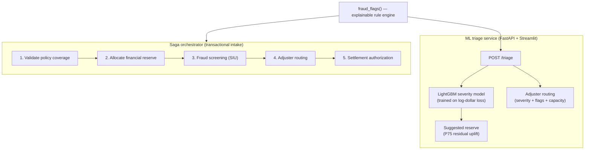
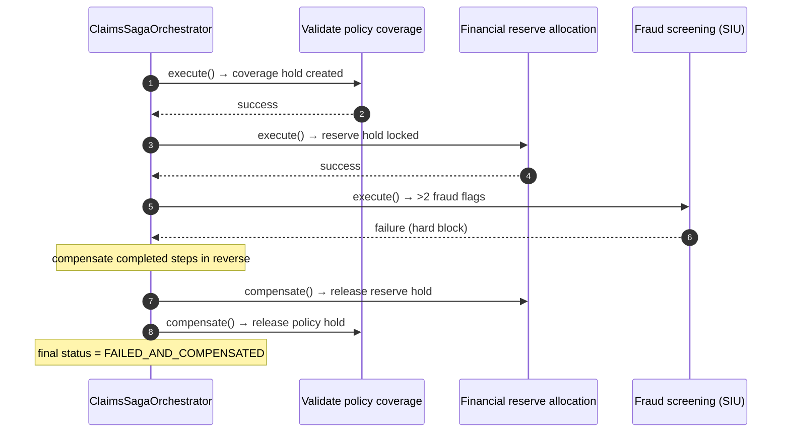

<div align="center">


</div>

# ClaimSight — Insurance Claims Triage & Saga Orchestration

**Score an insurance claim the moment it lands, and run its intake as a transaction that can safely roll back.** ClaimSight pairs a LightGBM severity model with an explainable fraud-rule engine to triage each claim — predicted loss, a suggested reserve, named fraud flags, and an adjuster route — then wraps the whole multi-system intake in a **Saga orchestrator** that compensates every completed step in reverse when a later step fails.

<div align="center">

[](https://www.python.org/)
[](https://fastapi.tiangolo.com/)
[](https://pytest.org/)
[](https://opensource.org/licenses/MIT)

</div>

> **Portfolio project.** Built to demonstrate an ML triage service and the Saga orchestration pattern on realistic (synthetic) claims data. Not hardened for production use.

---

## The problem

A property & casualty claim doesn't get adjudicated in one place. Intake touches several independent systems in sequence: confirm the policy is active and put a hold on it, lock loss-reserve capital against the balance sheet, screen for fraud, assign an adjuster, and mint a settlement authorization. Two things make this hard:

1. **Triage needs judgement up front** — how big is this loss likely to be, how much should we reserve, is anything suspicious, and who should handle it?
2. **The intake sequence is fragile** — if fraud screening blocks a claim at step 3, the reserve locked at step 2 and the policy hold from step 1 are now orphaned. Naïve pipelines leak these on every failure.

ClaimSight addresses both: an ML service answers the triage questions, and a Saga orchestrator guarantees that a failed intake leaves no dangling holds.

## What it does

- **Predicts loss severity** for a claim and derives a **suggested reserve** with a built-in safety margin.
- **Flags fraud with reasons, not scores** — each flag names the evidence that raised it (e.g. "reported 45 days after loss").
- **Routes claims by complexity and risk** — junior / senior / complex adjuster pools, with a hard diversion to Special Investigations when fraud flags pile up.
- **Runs intake as a Saga** — a five-step forward sequence with an automatic reverse-order compensation path on any failure, producing a full audit trace.

## How it works

ClaimSight has two cooperating parts that share one fraud-rule engine: an **ML triage service** exposed over HTTP, and a **Saga orchestrator** used programmatically.



The rule engine (`claimsight.models.triage.fraud_flags`) is the single source of truth for fraud signals — the API returns them per claim, and the Saga's screening step reuses the exact same rules to decide whether to hard-block.

## Saga orchestration & compensation

The orchestrator (`ClaimsSagaOrchestrator`) runs five steps forward. If any step returns failure or raises, forward execution halts and the orchestrator calls `compensate()` on every **successfully completed** step in reverse chronological order. The failing step is not compensated (it never took effect), and every action is recorded in a `SagaExecutionTrace`.



### Step & compensation matrix

| Step | Forward action | Failure condition | Compensating rollback |
|---|---|---|---|
| `ValidatePolicyCoverageStep` | Marks policy active, creates a policy hold | `policy_tenure_days <= 0` | Clears the policy hold, marks policy inactive |
| `FinancialReserveAllocationStep` | Locks a reserve at 115% of the claimed amount | Claimed amount exceeds the single-claim authority limit ($100,000 default) | Releases the reserve hold, zeroes the reserve |
| `FraudRiskScreeningStep` | Runs the fraud-rule engine, records flags | More than 2 flags → opens an SIU case and hard-blocks | Clears the SIU referral |
| `AdjusterRoutingStep` | Assigns a liability or auto adjuster | — | De-allocates the adjuster |
| `SettlementAuthorizationStep` | Mints a settlement authorization token | — | Voids the token |

## Methodology

### Severity model & reserve

Claim losses are heavy-tailed, so the model is trained on **log-dollar loss** (`log1p(final_severity)`) with a LightGBM regressor, then inverted with `expm1`:

$$\hat{S} = \exp\!\big(\hat{y}_{\log}\big) - 1$$

The **suggested reserve** doesn't just echo the point estimate — it shifts the log-prediction up by the empirical 75th-percentile residual measured on the holdout set, so reserves land above the point estimate often enough to guard against under-reserving:

$$\text{Reserve} = \exp\!\big(\hat{y}_{\log} + q_{0.75}[\,r_{\log}\,]\big) - 1, \qquad r_{\log} = y_{\log} - \hat{y}_{\log}$$

This is an empirical quantile of residuals — no Gaussian assumption. The uplift is fit at training time and pickled alongside the model.

### Explainable fraud rules

Flags are deterministic, auditable, and config-driven (`configs/config.yaml`). Each returns its supporting evidence string:

| Flag | Rule (defaults) |
|---|---|
| `late_report` | `report_delay_days >= 21` |
| `round_amount` | Claimed amount is a round multiple of $1,000 and `>= 1000` |
| `new_policy` | `policy_tenure_days <= 30` |
| `frequent_claimant` | `prior_claims_3y >= 3` |
| `no_police_report` | No police report **and** claim type is `auto_theft` or `property_fire` |

### Routing

Given predicted severity and flag count, `route()` assigns a queue: a claim with **2 or more flags** is diverted to `special_investigations`; otherwise it goes to the first adjuster pool whose severity ceiling it fits (`junior_pool` ≤ $8k, `senior_pool` ≤ $40k, else `complex_unit`). Weekly pool capacities live in config, and `/queue-stats` reports queue depth against them across a sampled book of claims.

## Getting started

```bash
make install                 # uv sync --group dev

uv run python scripts/make_claims.py     # generate synthetic claims (~20k, ~6% fraud)
uv run python -m claimsight.models.triage # train severity model, write data/artifacts/severity.pkl

make api                     # FastAPI on http://localhost:8250
make ui                      # Streamlit workbench on http://localhost:8751
make mlflow                  # MLflow UI on http://localhost:5026
```

The `/triage` and `/queue-stats` endpoints need a trained model on disk (`data/artifacts/severity.pkl`); generate data and train first, or they return `503`. The Streamlit UI reads the API location from `CLAIMSIGHT_API_URL` (defaults to `http://localhost:8250`).

Or with Docker:

```bash
make docker-up               # docker compose up --build -d  (API :8250, UI :8751)
make docker-down
```

## API

| Method | Route | Purpose |
|---|---|---|
| `GET` | `/health` | Liveness check |
| `POST` | `/triage` | Triage one claim → predicted severity, suggested reserve, fraud flags, route |
| `GET` | `/queue-stats` | Route a sampled book of claims → queue depth vs. weekly capacity and SIU share |

## Run the Saga directly

The orchestrator is a library component (there is no HTTP endpoint for it):

```python
from claimsight.saga import ClaimsSagaOrchestrator, SagaStatus

orchestrator = ClaimsSagaOrchestrator()

claim = {
    "claim_type": "auto_collision", "vehicle_age": 4, "injuries": 0,
    "police_report": 1, "report_delay_days": 2, "policy_tenure_days": 450,
    "prior_claims_3y": 0, "claimed_amount": 4200.0,
}
ctx, trace = orchestrator.execute_saga("CLM-1001", claim)
# trace.final_status == SagaStatus.COMPLETED
# ctx.reserve_amount_usd == 4830.0   (4200 × 1.15)

fraud_claim = {**claim, "report_delay_days": 45, "claimed_amount": 10000.0, "policy_tenure_days": 10}
ctx2, trace2 = orchestrator.execute_saga("CLM-1004", fraud_claim)
# trace2.final_status == SagaStatus.FAILED_AND_COMPENSATED
# trace2.compensated_steps == ("financial_reserve_allocation", "validate_policy_coverage")
# ctx2.reserve_amount_usd == 0.0    (cleanly rolled back)
```

## Evaluation

Everything is evaluated on **synthetic data** generated by `scripts/make_claims.py`, which plants a known fraud population (~6% of claims) with inflated, rounder, later-reported, young-policy characteristics — giving a ground truth to measure against.

- **Severity model:** training (`python -m claimsight.models.triage`) reports the **median absolute percentage error** on a held-out split and logs it to MLflow, along with the log-space reserve uplift. Numbers depend on the generated dataset and seed, so run the command to produce them for your configuration rather than trusting a fixed figure.
- **Fraud rules:** a test asserts the rules fire on planted-fraud rows meaningfully more often than on clean rows (see `test_flags_catch_planted_fraud_more_often`).
- **Saga:** tests assert the correct steps execute and compensate for success, policy-lapse, over-limit, and fraud-hard-block scenarios.

Reproduce:

```bash
uv run python scripts/make_claims.py
uv run python -m claimsight.models.triage   # prints/logs median APE + reserve uplift
```

## Testing

```bash
make test                    # uv run pytest --cov
```

- `tests/test_saga_orchestrator.py` — forward execution and reverse compensation across success and three failure modes
- `tests/test_triage.py` — severity model learning, fraud-rule separation, routing, and the FastAPI `/triage` + `/queue-stats` contract

## Limitations

- **Synthetic data throughout.** Both the severity model and the fraud thresholds are tuned to the generator; they would need recalibration on real claims.
- **Fraud detection is rule-based**, so it catches only the patterns encoded in `configs/config.yaml` and will miss novel schemes.
- **The Saga runs in-process** against an in-memory context — it demonstrates the compensation pattern but does not talk to real policy, treasury, or adjuster systems, and has no persistence or retry/idempotency layer.
- **The reserve uplift is a single global quantile**, not conditioned on claim type or severity band.

## Project structure

```
src/claimsight/
├── saga/         # Saga orchestrator, steps, and compensation types (the transactional core)
├── models/       # LightGBM severity model, reserve, explainable fraud rules, routing
├── api/          # FastAPI app (main:app) and routes (/triage, /queue-stats, /health)
├── ui/           # Streamlit triage workbench
└── settings.py   # env + configs/config.yaml loader
scripts/          # make_claims.py — synthetic claim generator
configs/          # config.yaml — fraud thresholds, routing pools, model params
```

## License

MIT

---

<div align="center">

**Jackson Marcus** · Senior AI & Machine Learning Engineer

[](https://github.com/jackson-marcus)
[](mailto:wajahatanees41@gmail.com)

</div>
