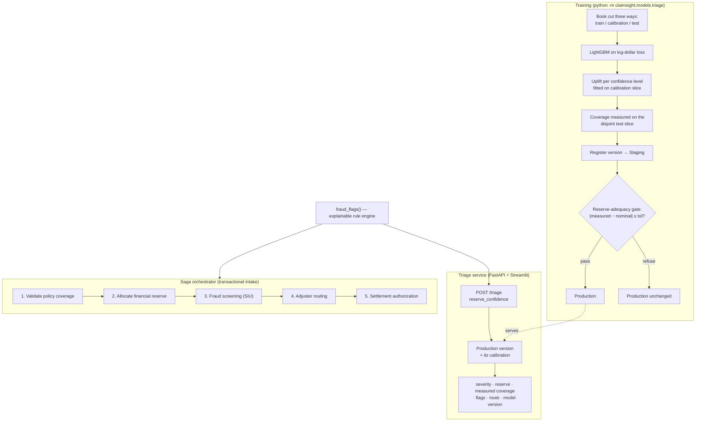
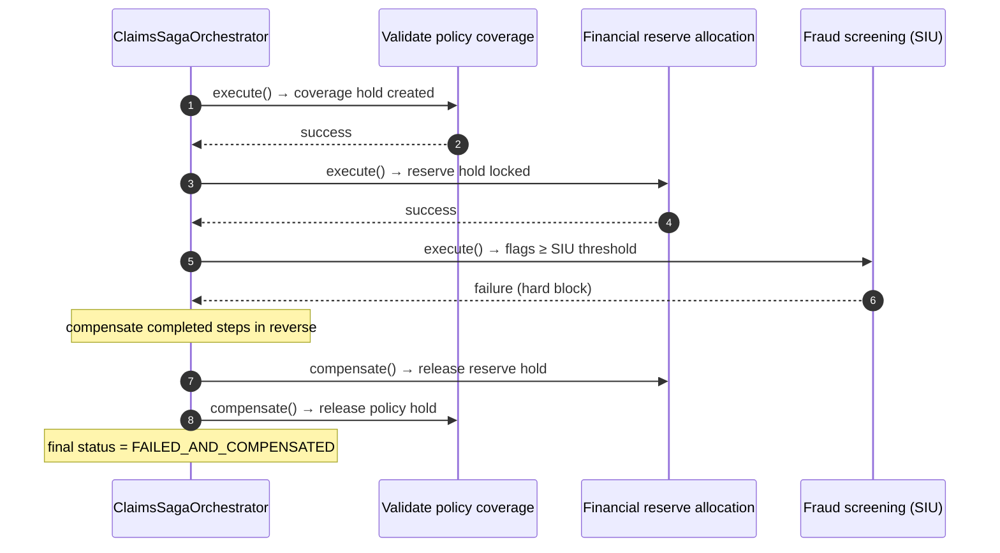

<div align="center">


</div>

# ClaimSight — Insurance Claims Triage & Saga Orchestration

**Score an insurance claim the moment it lands, book a reserve whose adequacy has actually been measured, and run the intake as a transaction that can safely roll back.** ClaimSight pairs a LightGBM severity model with an explainable fraud-rule engine to triage each claim — predicted loss, a reserve at the confidence *you* choose, named fraud flags, and an adjuster route — then wraps the whole multi-system intake in a **Saga orchestrator** that compensates every completed step in reverse when a later step fails.

<div align="center">

[](https://www.python.org/)
[](https://fastapi.tiangolo.com/)
[](https://pytest.org/)
[](https://opensource.org/licenses/MIT)

</div>

---

## The problem

A property & casualty claim doesn't get adjudicated in one place. Intake touches several independent systems in sequence: confirm the policy is active and put a hold on it, lock loss-reserve capital against the balance sheet, screen for fraud, assign an adjuster, and mint a settlement authorization. Three things make this hard:

1. **Triage needs judgement up front** — how big is this loss likely to be, is anything suspicious, and who should handle it?
2. **A point estimate is not a reserve.** What gets booked has to *cover* the ultimate loss some agreed share of the time. Under-reserve and you get adverse development; over-reserve and you have locked up capital that could be writing business. That share is a policy decision, and the only honest way to know you are hitting it is to measure it on claims the uplift never saw.
3. **The intake sequence is fragile** — if fraud screening blocks a claim at step 3, the reserve locked at step 2 and the policy hold from step 1 are now orphaned. Naïve pipelines leak these on every failure.

## What it does

- **Predicts loss severity** for a claim, and turns it into a **reserve at a chosen confidence** — 50%, 75%, 90%, 95% or 99% — reporting the coverage that setting *actually achieved* on a held-out slice, not the level it was asked for.
- **Flags fraud with reasons, not scores** — each flag names the evidence that raised it (e.g. "reported 45 days after loss").
- **Routes claims by complexity and risk** — junior / senior / complex adjuster pools, with a hard diversion to Special Investigations when fraud flags pile up.
- **Gates model promotion on reserve adequacy** — a retrained model only reaches Production if its measured coverage lands inside a tolerance band around nominal. Better median error is not enough.
- **Runs intake as a Saga** — a five-step forward sequence with an automatic reverse-order compensation path on any failure, producing a full audit trace.

## How it works

ClaimSight has two cooperating parts that share one fraud-rule engine and one flag threshold: an **ML triage service** exposed over HTTP, and a **Saga orchestrator** used programmatically.



The rule engine (`claimsight.models.triage.fraud_flags`) is the single source of truth for fraud signals, and `routing.fraud_unit_threshold` is the single source of truth for how many flags make an SIU case — the API routes on it and the Saga's screening step blocks on it.

## Reserve calibration

The severity model is trained on **log-dollar loss** (`log1p(final_severity)`) and inverted with `expm1`:

$$\hat{S} = \exp\!\big(\hat{y}_{\log}\big) - 1$$

The reserve shifts that log-prediction up by an empirical residual quantile — split-conformal, no Gaussian assumption:

$$\text{Reserve}(\alpha) = \exp\!\big(\hat{y}_{\log} + q_{\alpha}[\,r_{\log}\,]\big) - 1, \qquad r_{\log} = y_{\log} - \hat{y}_{\log}$$

The part that matters is *where each piece is fitted*. The book is cut three ways — 60% train, 20% calibration, 20% test. The model is fitted on train, the uplift $q_\alpha$ on calibration, and the coverage it achieves is measured on test, which neither has seen. Fitting the uplift and reporting its coverage on the same rows returns $\alpha$ by construction and tells you nothing.

That distinction is not cosmetic. Fitting the uplift on the training fold instead — the shortcut a two-way split invites — gives an uplift of **0.136 instead of 0.159**, because the model already fits its own training residuals too tightly, and the reserves it produces cover **71.8% of held-out claims against a nominal 75%**: 3.2 points of silent under-reserving. `ReserveAdequacyGate` exists to catch exactly that.

### What each confidence level costs

Averaged over 8 synthetic books of 20,000 claims (`uv run python scripts/reserve_calibration_report.py --books 8`):

| Nominal | Realized coverage (held out) | Reserves booked / incurred loss |
|---|---|---|
| 0.50 | 0.4946 | 0.962× |
| 0.75 | 0.7473 | 1.142× |
| 0.90 | 0.9022 | 1.318× |
| 0.95 | 0.9500 | 1.403× |
| 0.99 | 0.9907 | 1.555× |

Realized coverage tracks nominal to within 0.6 points at every level, and the price of the last 15 points of coverage (0.75 → 0.90) is about **15% more capital booked** (1.142x -> 1.318x). `/triage` and `/queue-stats` both take `reserve_confidence`, so that trade-off is a request parameter rather than a retraining job.

### Per-claim-type uplifts: measured, and dropped

An earlier version of this README listed "the uplift is a single global quantile, not conditioned on claim type" as a limitation. It was tried. Giving each claim type its own calibration quantile made the worst segment *worse* — mean max deviation from nominal **0.033 global vs 0.040 per-type**, worst-segment coverage **0.721 vs 0.715** — because the thinnest claim type contributes only 266–315 calibration claims and the sampling error of its own quantile swamps the bias it was meant to remove. So the global uplift stayed, and per-segment coverage is carried as **monitoring** instead: every `/triage` response reports how the global uplift has been performing on that claim's line of business, with the sample size behind the number, so a genuine drift is distinguishable from 300 rows of noise.

## Model registry and the promotion gate

Trained bundles land in a small on-disk registry (`data/artifacts/registry/`): numbered pickles plus an `index.json` recording each version's stage and metrics. Training always registers into `Staging` and then *asks* to be promoted.

`ReserveAdequacyGate` refuses in both directions — under-covering is adverse development, over-covering is idle capital — and a refusal leaves the index untouched, so `/triage` keeps serving whatever was in Production:

```text
PromotionRefusedError: v2 under-reserves: measured coverage 0.7120 vs nominal 0.75
                       (deviation -0.0380, tolerance +/-0.03)
```

This is the case median error alone would wave through: a challenger can improve `median_ape` and still book reserves that cover materially less of the book than the incumbent did. The two objectives are not the same, and only one of them shows up on the balance sheet.

The API keys its cached predictor on the index file's mtime and size, so a promotion (or a manual rollback — `promote()` without a gate) is picked up in-process. Previously the served bundle was memoised for the life of the process and a retrain went unnoticed until a restart.

## Saga orchestration & compensation

The orchestrator (`ClaimsSagaOrchestrator`) runs five steps forward. If any step returns failure or raises, forward execution halts and the orchestrator calls `compensate()` on every **successfully completed** step in reverse chronological order. The failing step is not compensated (it never took effect), and every action is recorded in a `SagaExecutionTrace`.



### Step & compensation matrix

| Step | Forward action | Failure condition | Compensating rollback |
|---|---|---|---|
| `ValidatePolicyCoverageStep` | Marks policy active, creates a policy hold | `policy_tenure_days <= 0` | Clears the policy hold, marks policy inactive |
| `FinancialReserveAllocationStep` | Locks a reserve at 115% of the claimed amount | Claimed amount exceeds the single-claim authority limit ($100,000 default) | Releases the reserve hold, zeroes the reserve |
| `FraudRiskScreeningStep` | Runs the fraud-rule engine, records flags | Flags reach `routing.fraud_unit_threshold` (2) → opens an SIU case and hard-blocks | Clears the SIU referral |
| `AdjusterRoutingStep` | Assigns a liability or auto adjuster | — | De-allocates the adjuster |
| `SettlementAuthorizationStep` | Mints a settlement authorization token | — | Voids the token |

Screening used to block only *above* two flags while `/triage` diverted at two, so a claim the API sent to Special Investigations could walk through intake and be handed a settlement token. Both now read the same config key.

## Explainable fraud rules

Flags are deterministic, auditable, and config-driven (`configs/config.yaml`). Each returns its supporting evidence string:

| Flag | Rule (defaults) |
|---|---|
| `late_report` | `report_delay_days >= 21` |
| `round_amount` | Claimed amount is a round multiple of $1,000 and `>= 1000` |
| `new_policy` | `policy_tenure_days <= 30` |
| `frequent_claimant` | `prior_claims_3y >= 3` |
| `no_police_report` | No police report **and** claim type is `auto_theft` or `property_fire` |

## Routing

Given predicted severity and flag count, `route()` assigns a queue: a claim with **2 or more flags** is diverted to `special_investigations`; otherwise it goes to the first adjuster pool whose severity ceiling it fits (`junior_pool` ≤ $8k, `senior_pool` ≤ $40k, else `complex_unit`). Weekly pool capacities live in config, and `/queue-stats` reports queue depth against them across a sampled book, together with the capital that book would tie up at the requested confidence.

## Getting started

```bash
make install                 # uv sync --group dev

uv run python scripts/make_claims.py      # generate synthetic claims (~20k, ~6% fraud)
uv run python -m claimsight.models.triage # train, calibrate, register, try to promote

make api                     # FastAPI on http://localhost:8250
make ui                      # Streamlit workbench on http://localhost:8751
make mlflow                  # MLflow UI on http://localhost:5026
```

Training prints its own numbers for your data and seed — median APE, the uplift, measured coverage, reserves-to-incurred, per-claim-type coverage, and whether the gate promoted the version:

```text
v1 median APE 16.2% | reserve coverage 0.753 at nominal 0.75 (worst level 0.90, +0.006) | reserves are 1.13x incurred | promoted=True
  segment auto_collision   n=1669  coverage 0.753
  segment auto_theft       n=306   coverage 0.706
  segment liability        n=578   coverage 0.747
  segment property_fire    n=299   coverage 0.749
  segment property_water   n=1148  coverage 0.772
```

`/triage`, `/queue-stats` and `/models` need a version in Production, so generate data and train first or they return `503`. The Streamlit UI reads the API location from `CLAIMSIGHT_API_URL` (defaults to `http://localhost:8250`).

Or with Docker:

```bash
make docker-up               # docker compose up --build -d  (API :8250, UI :8751)
make docker-down
```

## API

| Method | Route | Purpose |
|---|---|---|
| `GET` | `/health` | Liveness check |
| `POST` | `/triage` | Triage one claim → severity, reserve at `reserve_confidence`, its measured coverage, fraud flags, route, serving version |
| `GET` | `/queue-stats` | Route and reserve a sampled book → queue depth vs weekly capacity, SIU share, capital booked |
| `GET` | `/models` | Registered versions, their stage and adequacy metrics, and the calibrated confidence levels |

`reserve_confidence` must be one of the calibrated levels; anything else is a `400` that lists what is on offer.

```bash
curl -s -X POST localhost:8250/triage -H 'content-type: application/json' -d '{
  "claim_type": "property_water", "report_delay_days": 3,
  "policy_tenure_days": 800, "claimed_amount": 15000, "reserve_confidence": 0.9 }'
```

```json
{
  "predicted_severity_usd": 13244.69,
  "suggested_reserve_usd": 17889.99,
  "reserve_confidence": 0.9,
  "reserve_uplift_log": 0.3006,
  "measured_coverage": 0.9058,
  "segment_coverage": {"segment": "property_water", "n_test": 1148, "coverage": 0.7718},
  "fraud_flags": [{"flag": "round_amount", "evidence": "claimed exactly 15000"}],
  "route_to": "senior_pool",
  "model_version": 1
}
```

## Run the Saga directly

The orchestrator is a library component (there is no HTTP endpoint for it):

```python
from claimsight.saga import ClaimsSagaOrchestrator, SagaStatus

orchestrator = ClaimsSagaOrchestrator()

claim = {
    "claim_type": "auto_collision",
    "vehicle_age": 4,
    "injuries": 0,
    "police_report": 1,
    "report_delay_days": 2,
    "policy_tenure_days": 450,
    "prior_claims_3y": 0,
    "claimed_amount": 4200.0,
}
ctx, trace = orchestrator.execute_saga("CLM-1001", claim)
# trace.final_status == SagaStatus.COMPLETED
# ctx.reserve_amount_usd == 4830.0   (4200 × 1.15)

fraud_claim = {**claim, "claimed_amount": 10000.0, "policy_tenure_days": 10}
ctx2, trace2 = orchestrator.execute_saga("CLM-1004", fraud_claim)
# two flags (round_amount, new_policy) -> hard block
# trace2.final_status == SagaStatus.FAILED_AND_COMPENSATED
# trace2.compensated_steps == ("financial_reserve_allocation", "validate_policy_coverage")
# ctx2.reserve_amount_usd == 0.0    (cleanly rolled back)
```

## Evaluation

Everything is evaluated on **synthetic data** generated by `scripts/make_claims.py`, which plants a known fraud population (~6% of claims) with inflated, rounder, later-reported, young-policy characteristics — giving a ground truth to measure against.

- **Reserve adequacy** is the headline metric, because it is the one a reserving actuary would ask for. Reproduce every number in the calibration table above with:

  ```bash
  uv run python scripts/reserve_calibration_report.py --books 8
  ```

  It also reproduces the training-fold shortcut (71.8% realized coverage against nominal 75%) and the per-claim-type comparison that was measured and rejected.

- **Severity model:** training reports the median absolute percentage error on the test slice and logs it to MLflow alongside the reserve metrics. It depends on the generated dataset and seed, so run the command rather than trusting a fixed figure.
- **Fraud rules:** a test asserts the rules fire on planted-fraud rows meaningfully more often than on clean rows (`test_flags_catch_planted_fraud_more_often`).
- **Saga:** tests assert the correct steps execute and compensate for success, policy-lapse, over-limit, and fraud-hard-block scenarios, and that intake and triage agree on the SIU threshold.

## Testing

```bash
make test                    # uv run pytest --cov
```

- `tests/test_reserve_calibration.py` — uplift monotonicity, out-of-sample coverage against nominal, the capital/adequacy trade-off, and the training-fold under-reserving trap
- `tests/test_registry_promotion.py` — version staging, promotion archiving the incumbent, and the adequacy gate refusing both under- and over-reserving candidates without moving Production
- `tests/test_triage.py` — fraud-rule separation, routing, the severity model, and the `/triage` · `/queue-stats` · `/models` contract, including a promotion taking effect without a restart
- `tests/test_saga_orchestrator.py` — forward execution and reverse compensation across success and four failure modes

## Limitations

- **Synthetic data throughout.** Both the severity model and the fraud thresholds are tuned to the generator; they would need recalibration on real claims.
- **Fraud detection is rule-based**, so it catches only the patterns encoded in `configs/config.yaml` and will miss novel schemes.
- **Calibration is static.** The uplift is fitted once at training time on a snapshot of the book. Nothing here re-fits it as claims develop or watches live coverage drift away from the number measured at training; the per-segment figures in `/triage` are the raw material for that, not the mechanism.
- **The Saga runs in-process** against an in-memory context — it demonstrates the compensation pattern but does not talk to real policy, treasury, or adjuster systems, and has no persistence or retry/idempotency layer.
- **The registry is a directory of pickles**, adequate for one training host and not a substitute for MLflow's registry across a fleet.

## Project structure

```
src/claimsight/
├── saga/         # Saga orchestrator, steps, and compensation types (the transactional core)
├── models/       # LightGBM severity model, explainable fraud rules, routing, training entrypoint
├── features/     # Held-out residual extraction and reserve-adequacy calibration
├── model/        # Versioned model registry, promotion gate, and the serving predictor
├── api/          # FastAPI app (main:app) and routes (/triage, /queue-stats, /models, /health)
├── ui/           # Streamlit triage workbench
└── settings.py   # env + configs/config.yaml loader
scripts/          # make_claims.py — synthetic claims; reserve_calibration_report.py — adequacy study
configs/          # config.yaml — split fractions, confidence levels, gate tolerance, fraud thresholds, routing pools
```

## License

MIT

---

<div align="center">

**Jackson Marcus** · Senior AI & Machine Learning Engineer

[](https://github.com/jackson-marcus)
[](mailto:wajahatanees41@gmail.com)

</div>
